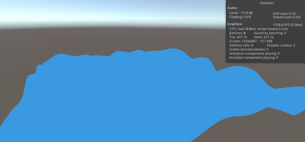

# Water

### First sum of sines waves

### Lambertian diffuse lighting

 
## Steps Taken

- Render simple plane

- Give plane many vertices

- Displace the vertices according to the sum of sines

- Use the vertex shader to displace the vertices
  - position
  - uvs
  - normals
  - tangents
  - vertex colors
  - vertex lighting

- Have the vertex shader calculate the sum of sines for each vertex position then send it off to the rest of the render pipeline
